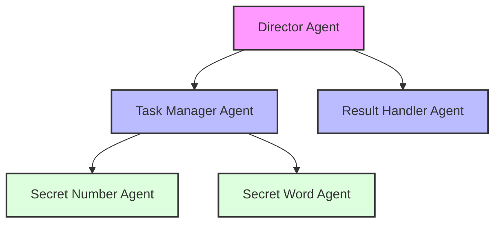

# Multi-Agent System with Pydantic AI

This is a simple example of how to build a multi-agent system with [Pydantic AI](https://ai.pydantic.dev/) including chat history memory.

The hierarchy of the multi-agent system is as follows:



The Director Agent is the main agent that is responsible for the overall tasks. It can delegate tasks to the Task Manager Agent who can delegate tasks to the Secret Number Agent and the Secret Word Agent.
The Secret Number Agent and the Secret Word Agent are responsible for providing a "secret" number and a "secret" word respectively.
The Result Handler Agent is responsible for handling the result of the task and to postprocess the result. It reports back to the Director Agent.

## Setup

1. Clone the repository

```bash
git clone https://github.com/achimstruve/pydanticAI-Multi-Agent-System.git
cd pydanticAI-Multi-Agent-System
```
2. Create a virtual environment

```bash
python -m venv venv
```

3. Activate the virtual environment

```bash
source venv/scripts/activate
```

4. Install the dependencies:

```bash
pip install -r requirements.txt
```

5. Create a `.env` file with the following variables:

```
OPENAI_API_KEY=your_openai_api_key
```

6. Run the agent system:

```bash
python main.py
```
